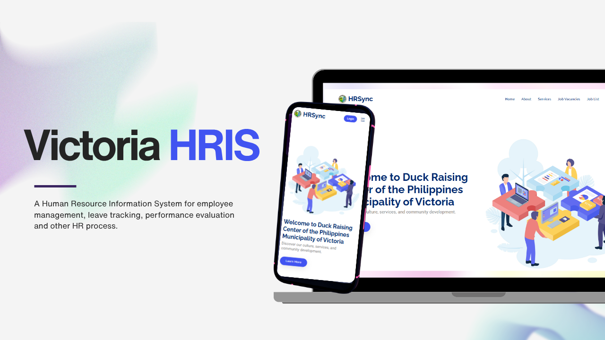
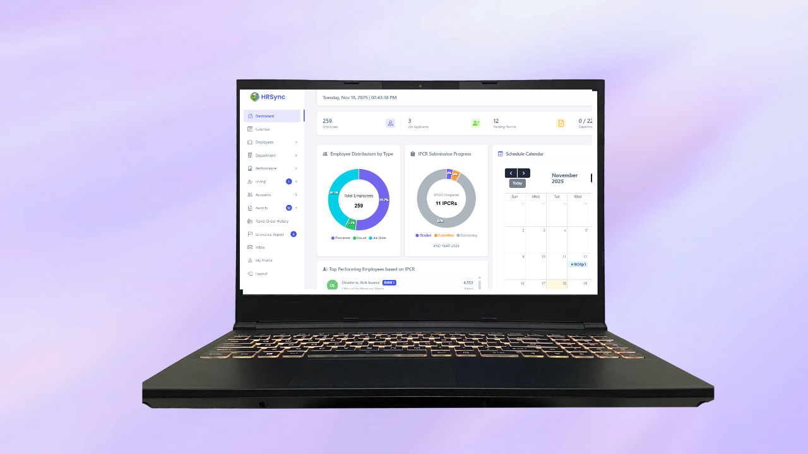

  

# 🧑‍💼 HRSync – Human Resource Information System (HRIS)

**HRSync** is a **web-based Human Resource Information System (HRIS)** designed to streamline HR operations, centralize employee data, and improve workforce management efficiency.

The system is built using **HTML, CSS, and JavaScript** for the frontend, powered by a **Flask (Python) backend** and a **MySQL database**, providing a reliable and scalable solution for managing core HR processes.

---

## 🖼️ Preview

| HR Dashboard | Calendar Page |
|-----------------|-----------------|
|  |  |

---

## 🚀 Features

- 🧑‍💼 **Employee Management**  
  Centralized employee records including personal information, roles, and departments.

- 📆 **Permit Management System**  
  Submit, approve, and track employee permit requests such as Leave, Travel, etc.

- 📊 **Performance Evaluation**  
  Employee performance reviews with ratings, feedback, and evaluation history.

- 🧲 **Hiring & Recruitment Management**  
  Manage job postings, applicant records, and hiring status from application to onboarding.

- 🎁 **Benefits Tracking**  
  Track employee benefits such as salary increases, tenure-based incentives, and benefits based on years of service.

- 🔐 **Role-Based Access Control**  
  Secure authentication for HR, Department Head, and Employee roles.

- 📈 **Reports & Analytics**  
  Generate HR reports to support data-driven decisions.

---

## 🛠️ Tech Stack

| Layer | Technology |
|------|------------|
| Frontend | HTML, CSS, JavaScript |
| Backend | Python (Flask) |
| Database | MySQL |
| Authentication | Session-based / JWT |
| Architecture | MVC / RESTful API |

---

